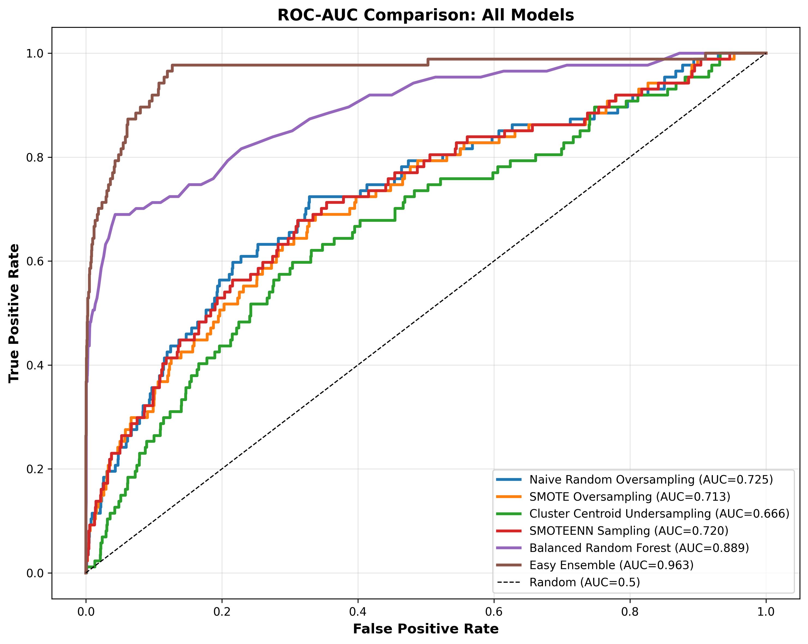
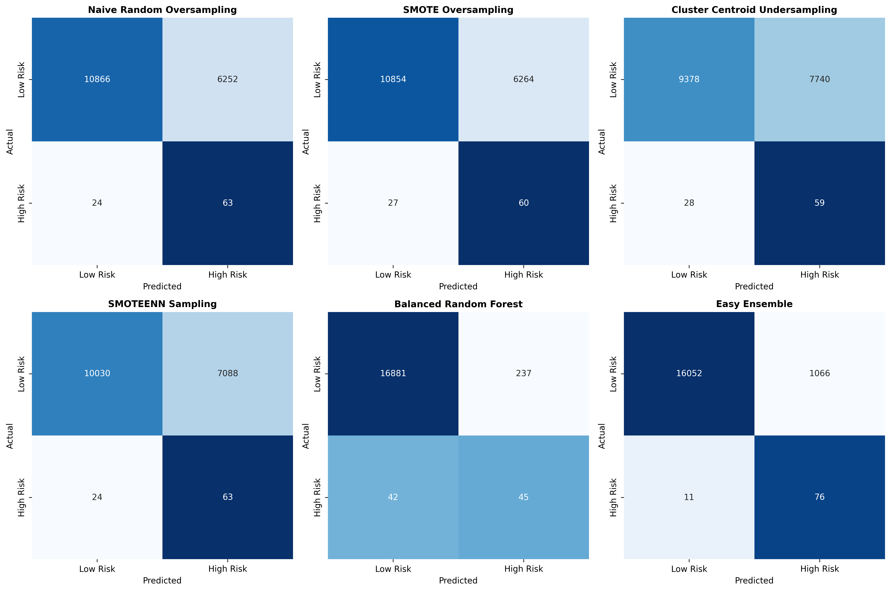
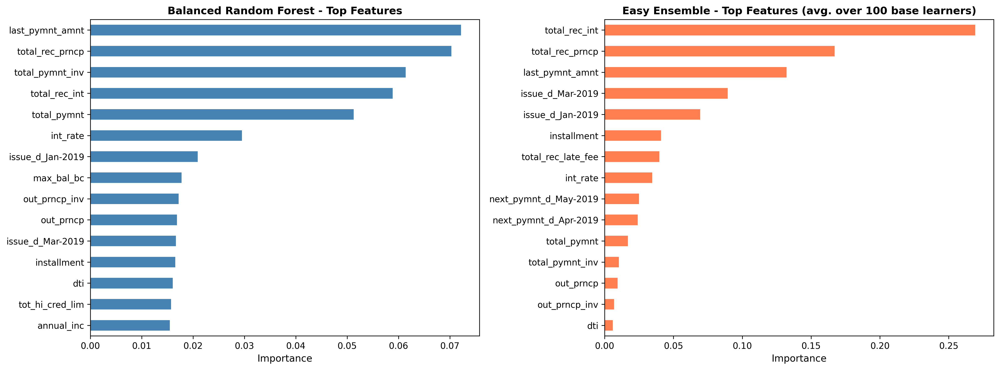

# Credit Risk Analysis

Evaluating 6 machine learning approaches to predicting loan default ("high risk" vs.
"low risk") on real LendingClub Q1 2019 loan data, using resampling techniques
(oversampling, undersampling, combination sampling) and ensemble learners built
specifically for imbalanced data.

> **2026 update:** this project was revisited to find and fix real bugs in the original
> analysis (a reversed train/test split, a data-leakage bug, and two mislabeled
> algorithms), then extended with threshold optimization, cross-validation,
> hyperparameter tuning, and SHAP explainability. The results below are the corrected
> numbers. See [`session_summary.md`](session_summary.md) for the full technical
> walkthrough, including every bug found and why each one mattered.

## Project

The dataset (~86,000 loans, 95 features after encoding) is heavily imbalanced: only
about 0.5% of loans in the test set actually default. Six methods were compared:

1. Naive Random Oversampling
2. SMOTE Oversampling
3. Cluster Centroid Undersampling
4. SMOTEENN (combination) Sampling
5. Balanced Random Forest
6. Easy Ensemble (AdaBoost)

Methods 1-4 resample the training data and feed it to Logistic Regression; methods 5-6
balance classes internally as part of the ensemble.

## Results

All numbers below are from a single stratified 80/20 train/test split
(`random_state=1`), reproduced by [`run_full_analysis.py`](run_full_analysis.py).

| Method | Balanced Accuracy | Precision (high risk) | Recall (high risk) | Specificity | F1 | ROC-AUC |
|---|---|---|---|---|---|---|
| Naive Random Oversampling | 0.679 | 0.010 | 0.724 | 0.635 | 0.020 | 0.725 |
| SMOTE Oversampling | 0.662 | 0.009 | 0.690 | 0.634 | 0.019 | 0.713 |
| Cluster Centroid Undersampling | 0.613 | 0.008 | 0.678 | 0.548 | 0.015 | 0.666 |
| SMOTEENN Sampling | 0.655 | 0.009 | 0.724 | 0.586 | 0.017 | 0.720 |
| Balanced Random Forest | 0.752 | 0.160 | 0.517 | 0.986 | 0.244 | 0.889 |
| **Easy Ensemble** | **0.906*** | 0.067 | 0.874 | 0.938 | 0.124 | **0.963** |

\* **Caveat:** 5-fold cross-validation put Easy Ensemble's balanced accuracy at
**0.858 ± 0.009**, a full 5 standard deviations below this single-split value — the
90.6% figure was an optimistic split for that specific metric, not a representative
one. Its ROC-AUC held up fine in cross-validation (0.950 ± 0.015 vs. 0.963 here), so
the model ranking is trustworthy even though this one number should be read as ~86%,
not 90.6%. Full cross-validation results for all 6 methods: [`cross_validation_results.csv`](cross_validation_results.csv).




## Recommendation

**Easy Ensemble** is the strongest model here: highest ROC-AUC (0.963, holding up
under cross-validation) and highest recall on defaults (87%), at the cost of a high
false-positive rate (only 6.7% precision — most loans it flags high-risk are actually
fine). Hyperparameter tuning ([`run_hyperparameter_tuning.py`](run_hyperparameter_tuning.py))
found no improvement over the default settings used here, so this result isn't an
artifact of an unlucky configuration choice.

### Choosing a decision threshold matters

The default 0.5 probability threshold isn't necessarily the right one for a business
use case. [`run_threshold_optimization.py`](run_threshold_optimization.py) compares
thresholds under a cost model (denying a good customer costs $1,000; approving a
defaulter costs $5,000):

| Threshold | Precision | Recall | Acceptance Rate | Default Rate Among Accepted | Total Cost |
|---|---|---|---|---|---|
| 0.5 (default) | 0.067 | 0.874 | 93.4% | 0.07% | $1,121,000 |
| 0.59 (F1-optimal) | 0.706 | 0.414 | 99.7% | 0.30% | $270,000 |

At this cost ratio, raising the threshold to 0.59 cuts total cost by $851,000 despite
catching far fewer actual defaulters (41% recall vs. 87%) — because at 0.5 the model
over-flags good customers in bulk. The right threshold depends entirely on real
denial/default costs, which weren't available for this exercise; treat the
$1,000/$5,000 figures as illustrative. Full comparison:
[`threshold_comparison.csv`](threshold_comparison.csv).

### What drives the predictions



SHAP analysis ([`shap_balanced_rf_summary.png`](shap_balanced_rf_summary.png),
[`shap_easy_ensemble_summary_APPROX.png`](shap_easy_ensemble_summary_APPROX.png))
confirms the same top features via a completely independent method: repayment
history (`total_rec_prncp`, `last_pymnt_amnt`) and `int_rate` dominate, as expected.
One caveat worth flagging in any use of this model: the loan issue month
(`issue_d_Jan-2019` / `issue_d_Mar-2019`) also ranks near the top for both models.
Since this dataset is a single quarter, loans issued earlier simply had more time to
default — this may be a temporal artifact of the dataset rather than a genuine risk
signal, and shouldn't be taken as "loans issued in January are riskier" without
further investigation on a longer time span.

## What changed from the original analysis

The original notebooks had two bugs that materially changed the results:
- The train/test split's return values were swapped, so models trained on 25% of the
  data and were "tested" on the other 75%.
- The "Cluster Centroid Undersampling" and "Balanced Random Forest" sections actually
  ran different algorithms than labeled (`RandomUnderSampler` and plain
  `RandomForestClassifier`, respectively).

Fixing these changed several of the numbers above meaningfully, though the overall
conclusion — Easy Ensemble is the best model for this problem — held up and got
stronger with real, defensible numbers behind it. Full bug-by-bug writeup, including
every issue found while extending the analysis (threshold optimization,
cross-validation, hyperparameter tuning, SHAP), is in
[`session_summary.md`](session_summary.md).

## Reproducing this

```
pip install imbalanced-learn shap
python3 run_full_analysis.py            # trains all 6 models, saves model_results.pkl
python3 run_threshold_optimization.py   # threshold tuning + cost-benefit
python3 run_cross_validation.py         # 5-fold CV on all 6 methods
python3 run_hyperparameter_tuning.py    # GridSearchCV on the two ensemble models
python3 run_shap_explainability.py      # SHAP values for Balanced RF and Easy Ensemble
```

`LoanStats_2019Q1.csv` (the LendingClub Q1 2019 loan data) must be present in the
working directory.
